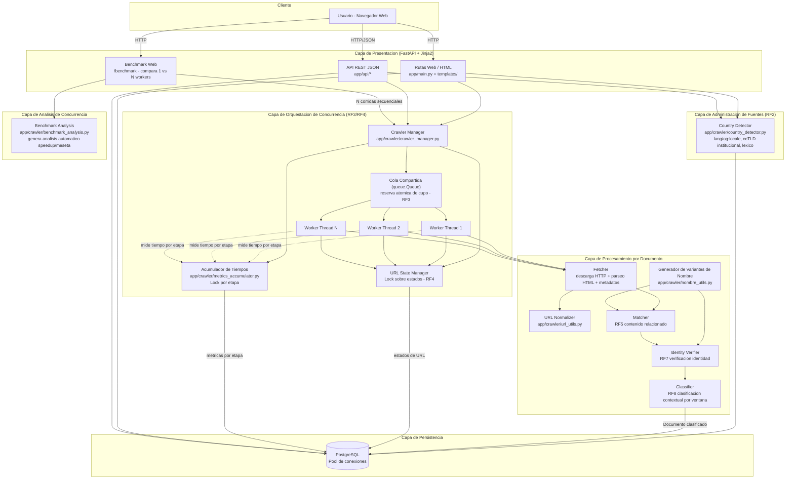

# Diagrama de Arquitectura de Software — Reputa Monitor

## Justificación de capas

1. **Presentación**: FastAPI expone vistas HTML (para uso humano y para
   la sustentación, incluyendo el benchmark visual en `/benchmark`),
   una API JSON (para pruebas automatizadas o integración), y comparten
   toda la lógica de negocio subyacente.
2. **Administración de fuentes (RF2)**: el país de una fuente se
   determina automáticamente analizando el contenido de su URL semilla
   (nunca la ubicación del servidor). El detector prioriza dominios
   institucionales (`.edu.co`, `.gov.co`) sobre el idioma declarado,
   porque este último suele ser un valor por defecto de plantilla poco
   confiable.
3. **Orquestación de concurrencia**: es el corazón del taller. El
   `Crawler Manager` arma el pool de N workers configurables (RF3),
   les entrega una cola compartida thread-safe con reserva atómica de
   cupo (evita URLs huérfanas más allá del límite de exploración), un
   gestor de estados con sincronización explícita (RF4), y un
   acumulador de tiempos por etapa para la medición de concurrencia.
4. **Procesamiento por documento**: pipeline puro (sin estado
   compartido) que cada worker ejecuta de forma aislada. Incluye
   normalización de URLs (evita duplicados por variaciones
   superficiales) y generación de variantes de nombre (reconoce
   menciones realistas como "Nombre Apellido", no solo el nombre legal
   completo).
5. **Análisis de concurrencia**: a partir de las métricas persistidas,
   genera automáticamente el análisis textual (speedup, detección de
   meseta) que exige la rúbrica, mostrado en vivo en `/benchmark`.
6. **Persistencia**: PostgreSQL con un pool de conexiones
   (`pool_size=20`) para soportar escrituras concurrentes desde
   múltiples workers sin agotar conexiones.

## Patrón de concurrencia usado

- **Productor-consumidor** con `queue.Queue` (thread-safe nativamente).
- **Terminación dinámica** vía `queue.join()` + sentinelas, porque el
  número total de URLs a procesar no se conoce de antemano (los propios
  workers descubren nuevas URLs).
- **Sección crítica mínima**: el `Lock` del `URLStateManager` solo
  protege la transición de estado (una operación de BD muy corta); la
  descarga HTTP (lo lento) ocurre siempre fuera del lock.
- **Reserva atómica de cupo**: antes de registrar una URL descubierta,
  se reserva su lugar en el límite de exploración con un `Lock`
  dedicado (`ColaURLsCompartida.intentar_reservar_slot`), evitando que
  se creen registros que nunca serán procesados.
- **Acumulación thread-safe de métricas**: cada worker reporta el
  tiempo de sus sub-etapas (descarga, matching, verificación,
  clasificación) a un acumulador protegido por `Lock`, sin serializar
  el trabajo real.
