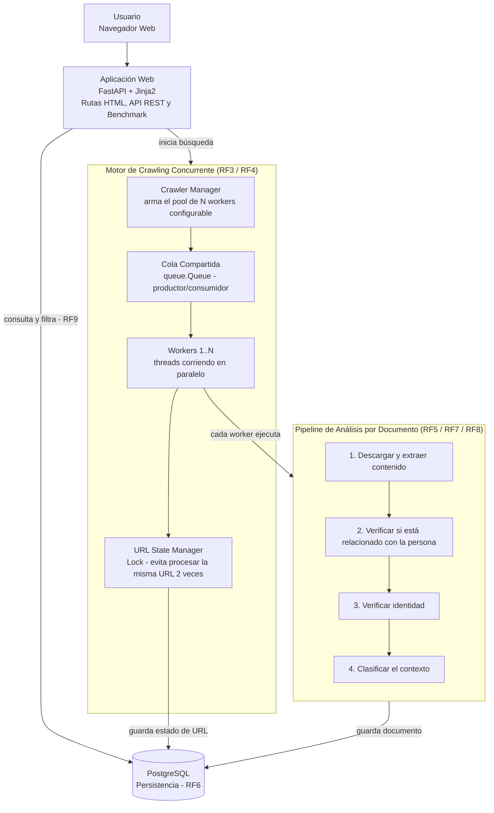
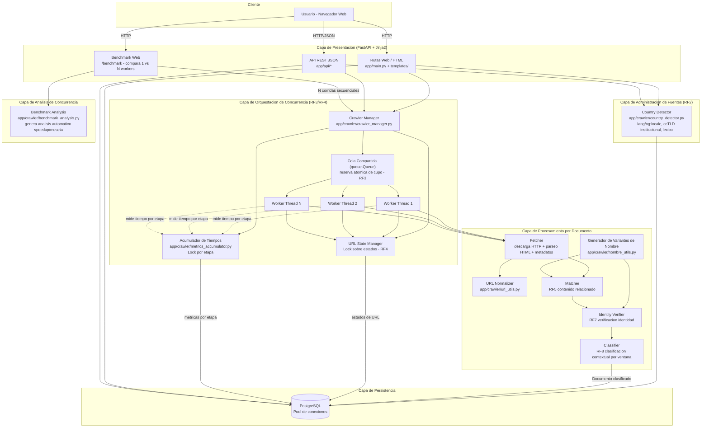

# Diagrama de Arquitectura de Software — Reputa Monitor

**Cómo funciona**: el usuario inicia una búsqueda desde
la web. El *Crawler Manager* arma un pool de N workers (threads) que
comparten una cola de URLs pendientes. Cada worker, antes de procesar
una URL, pasa por el *URL State Manager*, que usa un `Lock` para
garantizar que ninguna URL sea tomada por dos workers a la vez (RF4).
Una vez que un worker "gana" una URL, corre el pipeline de análisis
(descarga → matching → verificación de identidad → clasificación) de
forma totalmente independiente de los demás workers, y al final
persiste el resultado en PostgreSQL.

---

## Vista detallada (referencia, incluye todos los módulos)

## Patrón de concurrencia usado

- **Productor-consumidor** con `queue.Queue` (thread-safe nativamente).
- **Terminación dinámica** vía `queue.join()` + sentinelas, porque el
  número total de URLs a procesar no se conoce de antemano (los propios
  workers descubren nuevas URLs).
- **Sección crítica mínima**: el `Lock` del `URLStateManager` solo
  protege la transición de estado (una operación de BD muy corta); la
  descarga HTTP (lo lento) ocurre siempre fuera del lock.
- **Reserva atómica de cupo**: antes de registrar una URL descubierta,
  se reserva su lugar en el límite de exploración con un `Lock`
  dedicado (`ColaURLsCompartida.intentar_reservar_slot`), evitando que
  se creen registros que nunca serán procesados.
- **Acumulación thread-safe de métricas**: cada worker reporta el
  tiempo de sus sub-etapas (descarga, matching, verificación,
  clasificación) a un acumulador protegido por `Lock`, sin serializar
  el trabajo real.
