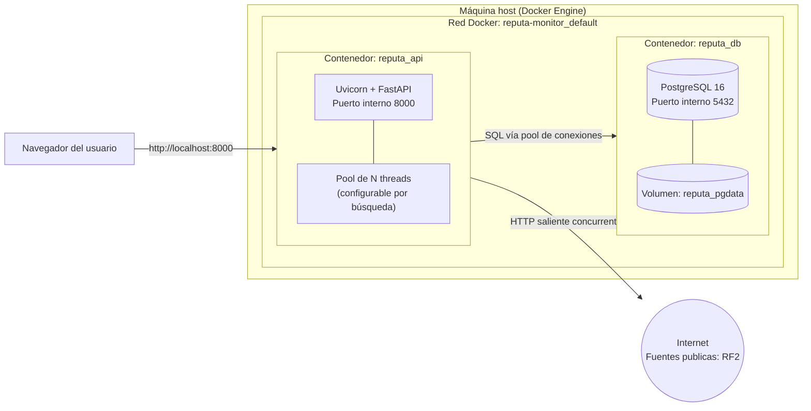

# Diagrama de Infraestructura — Reputa Monitor

## Componentes desplegados

| Contenedor | Imagen base | Rol | Puertos expuestos |
|---|---|---|---|
| `reputa_api` | `python:3.12-slim` | API + UI web + orquestador del crawler concurrente | `8000:8000` |
| `reputa_db` | `postgres:16-alpine` | Persistencia relacional | `5432:5432` |

  perder resultados entre sesiones de pruebas/sustentación.
- Ambos contenedores se comunican por la **red interna de Docker
  Compose** (`reputa-monitor_default`), resuelta por nombre de servicio
  (`db`), no por IP fija.
