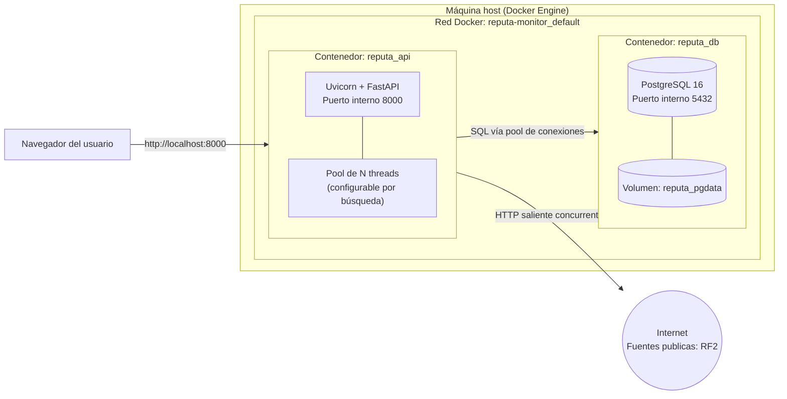

# Diagrama de Infraestructura — Reputa Monitor

## Componentes desplegados

| Contenedor | Imagen base | Rol | Puertos expuestos |
|---|---|---|---|
| `reputa_api` | `python:3.12-slim` | API + UI web + orquestador del crawler concurrente | `8000:8000` |
| `reputa_db` | `postgres:16-alpine` | Persistencia relacional | `5432:5432` |

## Notas de infraestructura relevantes para el taller

- Los **N workers del crawler son threads dentro del proceso del
  contenedor `reputa_api`**, no contenedores ni procesos separados —
  por eso el diagrama los muestra como un pool interno. Esto es
  coherente con la decisión técnica documentada en
  `docs/ARQUITECTURA.md` (I/O-bound → threading, no multiprocessing).
- El **tráfico de red saliente concurrente** (múltiples requests HTTP
  simultáneas a distintas fuentes) es justamente lo que se mide y
  compara en la funcionalidad de benchmark, disponible tanto por
  línea de comandos (`app/crawler/benchmark.py`, útil para generar
  gráficos con matplotlib para el informe) como integrada a la propia
  aplicación web (`/benchmark`, para demostrarlo en vivo durante la
  sustentación sin salir a la terminal).
- `reputa_db` usa un **volumen nombrado** (`reputa_pgdata`) para que los
  datos persistan aunque el contenedor se reinicie — importante para no
  perder resultados entre sesiones de pruebas/sustentación.
- Ambos contenedores se comunican por la **red interna de Docker
  Compose** (`reputa-monitor_default`), resuelta por nombre de servicio
  (`db`), no por IP fija.
