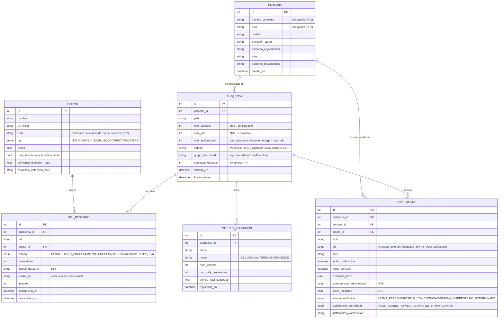

# Modelo de Datos — Reputa Monitor

## Diagrama entidad-relación

## Decisiones de diseño relevantes

- **`UrlRegistro.estado`** es el recurso compartido crítico del taller
  (RF4). Su transición está protegida por un `threading.Lock` en
  `app/crawler/state_manager.py`, no solo por la base de datos.
- **`UniqueConstraint(busqueda_id, url)`** en `UrlRegistro` y en
  `Documento` es una segunda barrera (defensa en profundidad) contra
  duplicados, complementaria al lock en memoria — si dos procesos
  distintos (no solo threads) llegaran a coexistir, la BD seguiría
  garantizando unicidad. Las URLs se normalizan antes de compararse
  (`app/crawler/url_utils.py`), para que variaciones superficiales
  (barra final, parámetros de rastreo `utm_*`) no cuenten como
  distintas.
- **`worker_id`** en `UrlRegistro` guarda qué hilo procesó cada URL:
  es la evidencia que se muestra en la sustentación para demostrar que
  el trabajo se distribuyó entre varios workers reales.
- **`MetricaEjecucion`** existe para soportar el ítem de la rúbrica
  "Medición de concurrencia": no solo guarda el tiempo total del
  crawling, sino una fila POR ETAPA (`RF3_descarga_html`,
  `RF4_control_estado_url`, `RF5_matching_contenido`,
  `RF7_verificacion_identidad`, `RF8_clasificacion_contextual`),
  registrada por un acumulador thread-safe
  (`app/crawler/metrics_accumulator.py`).
- **`Fuente.pais_detectado_automaticamente` / `confianza_deteccion_pais`
  / `evidencia_deteccion_pais`**: el país de una fuente se determina
  analizando el CONTENIDO de la URL semilla (idioma del HTML,
  `og:locale`, dominio institucional, léxico) — nunca la ubicación del
  servidor. Ver `app/crawler/country_detector.py`. Si la detección
  automática no logra suficiente confianza, el administrador puede
  corregirlo manualmente, y esa corrección queda registrada aquí.
- **`Busqueda.grupo_benchmark` / `conflictos_evitados`**: soportan la
  funcionalidad de benchmark 1-vs-N-workers integrada a la aplicación
  web (`/benchmark`), que agrupa varias corridas de la misma búsqueda
  con distinto número de workers para compararlas bajo condiciones
  equivalentes.
- Los borrados están configurados en **cascada** a nivel de ORM
  (`cascade="all, delete-orphan"`): eliminar una `Persona` elimina
  también sus búsquedas, URLs, documentos y métricas asociadas.
